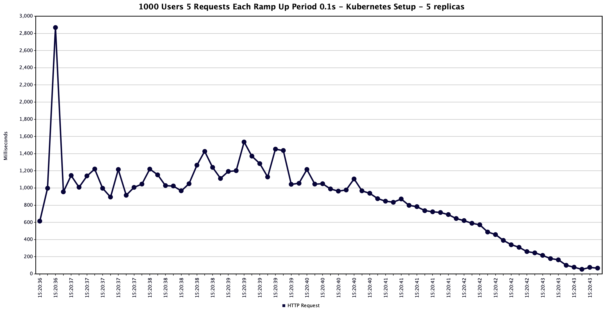

# Highly Scalable System for Processing incoming data

Tech Stack - NodeJs, Docker, Kubernetes, Apache Kafka, Google Sheets API

## Requirement Analysis

- On submission of form data, trigger variour tasks to process the data and perform different actions based on it, for example - storing it in google sheets, send confimation to users, do analysis to detect slangs etc.

- New tasks to be performed on form submission should added in a "plug and play" fashion without requiring major changes to backend.

- optimize for latency and having a unified interface acting as a middleman.

- failsafe, should eventually recover from circumstances like power/internet/service outages

- should scale to cases like millions of responses across hundreds of forms for an organization

## Architecuture / Approach

There are various tasks that could be performed on the submitted form data, some of these tasks could be popular among customers creating the forms and they might have them in their form submission pipeline more often than the others. To be able to horizontally scale components individually, it makes sense to choose **microservice** architecture where the different tasks would be completely decoulpled micro services over the traditional monolith approach.

We want over system to be redundant and fault tolerant and we want to scale our services quickly up and down depending upon the workload hence using a cloud-agnostic container Orchestration tool like **Kubernetes** is a good idea.

Instead of having rest based microservices, we should have event driven microservices.

Please navigate to the png file `/docs/image/architecture.png` to examine it in greater detail.

The incoming traffic is redirected to the correct form microservice using ingress, the grafana dashboard to view metrics for the cluster will also be accessible through ingress. We currently have two form microservices, the student data form which is the fully functioning form that writes form data to google sheets and a demo form and a demo form consumer which will act as enabler to easily onboard new forms or new plugins that consume data in different form data streams.

The student data form deployment is horizontally scalable and the number of instances for the same could be easily scaled using the command

    kubectl scale deployment/student-data-form-deployment --replicas=<desired-number-of-replicas>

All the replicas are under a cluster IP service, since the pods themselves are ephemeral they could crash and the deployment creates a new pod to ensure that the given number of replicas are always running. When a crashed pod is brought up back again by the deployment it might have a different IP address, so the cluster IP service provides a fixed DNS record to connect to pods in a deployment and also does load balancing among the pods.

The Student Data form receives the input data from the user, performs validation and santizies the data and produces a kafka event which is sent to the kafka cluster.

Kafka is inherently scalabalbe and fault tolerant, each topic is divided into partitions and the partitions are spread out across different brokers in the kafka cluster. Also, copies of a partition exisits in other brokers, among all the partiiton a leader is selected, even when the leader goes down the data is still secure in its copies on other brokers.

Different consumer groups could subscribe to one of more kafka "topcis". A kafka "event" from a kafka "topic" is sent to only one consumer from a consumer group, but two consumers belonging to different consumer groups could consume the same event. Let's say that there are two services that are listening to our student data form events, the student data form consumer service which pushes the form data to google sheets and another service which let's say performs some analysis to check for slangs. To get the benefits of hoizontal scaling we could have multiple instances of both of these to make consumer of kafka events faster, all the instances of only one consumer would belong to one consumer group, this ensures that different instances of the same service do not consume the same event and results get duplicated.

The consumer do not have a cluster IP service because nothing is pushing data to the consumer, different instances of the consumer pull events from the stream. The consumer could be scaled with the following command

    kubectl scale deployment/student-data-form-consumer-deployment --replicas=<desired-number-of-replicas>

However, one limitation over the scalability of consumer could be that we probably would not want to have more consumers than there are partitions in a topic, as each consumer reads from a different partition. After a point scaling consumers and the kafka cluster goes together.

The consumer services themselves could consume from one kafka stream, further process the data and write to another or the same kafka stream. One example for this could be to some machine learning/analytics or sematic analysis which might require some processing on the raw data first, the processor service would consume from the main stream and write to the processed stream which could be consumed by the machine leaning and semantic analyis services.

Since there are obviously some limitations on using extral APIs to add data to google sheets, instead of making an API call for every form submission, we would probably want to make batch updates to the Google Sheet with a single API call. The student data form consumer, consumes the events and write them into a fast data in-memory redis sentinal managed cluster. Writes are made only to the master in the redis cluster and the data on the master is replciated onto the slaves to ensure reliability. We are not doing much reading reading from the redis data store but the replicas still ensure that the data is not lost when the master goes down. When the master goes down then the redis sentinal kicks in and one of the slaves are made the master and a new slave is spun up. We have `CronJob` kubernetes object that would once in while write the data from the redis datastore to google sheets and flush the datastore.

However there is one issue, lets say that a form A was submiited now and another form B was submitted after that, but there's still a chance that the later form, form B could be processed first by the instances of the student data form service and the order in which the forms were submitted might be disturbed. If the order is of importance to us, then when the form is recieved at the student data form service, the instance might attach a timestamp to event and we could use a sorted set in redis datastore to maintain sorting based on timestamp this would preverse the order of form submission upto a good extent. However the order of submission is not important that we could comsume events from the kafka stream itself in batches.

Currently, the redis datastore, cron job and prometheus is not implemented due to time constraints. However, the kafka cluster, deployments to manage and scale pods of student data form and demo for mas well as deployments their consumers and their cluster IP services and ingress to route traffic to them are fully impleted.

## Load Testing

Apache JMeter was to use to do load testing

The test simulates requests coming in very fast from 1000 users and each user makes 5 requests.

Here is the response time graph for a single docker container handling the requests

The average time taken for a response is **1858** ms.

However with 5 replicas in Kubernetes the average response time almost **halves** to **1056** ms.

Below is the response time graph for 5 replicas in Kuberentes

## Further Possible Improvements

- JavaScript is a single threaded language, so is NodeJs mostly. Being single threaded, its blocking by nature. Ideally we would want to create a new thread for every request to a service so that during its processing it does not block other requests, this is especially applicable for computation heavy tasks which none of our services are doing here but this effect should still be imrpotance when handling millions of requests. However, its so easy to scale a deployment in kubernetes and get the benefits of horizontal scaling that handling multiple threads might not be worth it. The best appraoch would be use a very fast language which provides built in support for concurrency, like golang.

- The different services that need data from the stream could process that in realtime but the form data could still be required in future for some purpose. Kafka could retain events even after they are consumed, depending upon their retention policy but kafak is not a database and should not be used as one. We would probably want to add a traditional database to permatently store all responses, using a distributed database with consistent hashing should work fine here.

## Setup

Link to Linked [Google Sheet](https://docs.google.com/spreadsheets/d/16cAsR7LjVYj66gxhVVMAriMxwWdAXb3lxBN4raCAbh4/edit?usp=sharing)

The application has a kubernetes first architecutre to ensure high scalability and reliability, but the application could be run through a simple docker setup through docker-comopse. We discuss setup for both in the following sections

### Kubernetes Setup

Link to Kubernetes Installation and Demo - [youtube video](https://youtu.be/UOz46btrXO0)

Install [minikube](https://v1-18.docs.kubernetes.io/docs/tasks/tools/install-minikube/) on local environment of setup a kubernetes cluster on a cloud platform

Start minikube with the following command

    minikube start --vm=true --driver=hyperkit

Install [Helm](https://helm.sh/docs/intro/install/)

This project uses the [strimzi](https://strimzi.io/) operator to manage the kafka cluster, install it using the commands below

    helm repo add strimzi https://strimzi.io/charts/
    helm install my-release strimzi/strimzi-kafka-operator

Deploy the kafka cluster and zookeeper with the following command

    kubectl apply -f kubernetes/kafka/kafka-persistent-single.yaml

For production, use the `kafka-persistent-multiple.yaml` file, it deploys a multi broker kafka cluster.

Create Kafka topic using the command

    kubectl apply -f kubernetes/kafka/student-data-form-kafka-topic.yaml
    kubectl apply -f kubernetes/kafka/demo-form-kafka-topic.yaml

On minikube, enable ingress

    minikube addons enable ingress

Deploy all other kubernetes objects like, deployments for different microservices, cluster IP services, ingress using the command

    kubectl apply -f kubernetes

get the ip address of minikube using

    minikube ip

Send `POST` request to `http://<minikube-ip>/student-data-form/` to submit a form

    {
        "name": "Saurabh raj",
        "roll": "99999",
        "university": "BCE",
        "cgpa": "8.04",
        "gender": "F",
        "age": "10.11",
        "email": "kumarsaurabhraj.sr@gmail.com",
        "mobile": "7004465984"
    }

### Setup through docker-compose

    docker-comopse up

Creating Kafka Topic

    docker exec -it kafka /opt/kafka/bin/kafka-topics.sh \
    --create \
    --zookeeper zookeeper:2181 \
    --replication-factor 1 \
    --partitions 1 \
    --topic student-data
